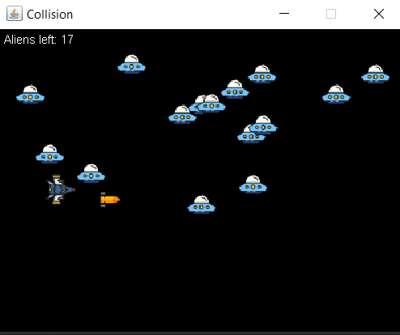

# Collision Detection
### Anggota Kelompok
1. Afifah Nur Sabrina Syamsudin 05111940000022
2. Vyra Fania Adelina 05111940000109
3. Abiya Sabitta Ragadani 05111940000166

## Penjelasan Program
Program ini memiliki beberapa class yaitu
1. Alien
2. Board
3. Missile
4. SpaceShip
5. Sprite
6. CollisionEx

Penjelasan sederhananya adalah terdapat class-class yang dapat bergerak di dalam game tersebut seperti alien, missile, dan spaceship. Kemudian objek tersebut akan diinisiasi pada class board dan akan digunakan saat game tersebut dijalankan.

### Sprite
Class Sprite ini adalah class yang mengenkapsulasi objek-objek yang dapat bergerak di dalam game. Pada class ini terdapat method-method yang nanti akan digunakan pada class lainnya. Method pada class ini adalah
1. Constructor yang akan menginisiasi titik koordinat x, y, dan variable visible.
2. Method yang akan digunakan untuk mendapat gambar dan ukuran gambar tersebut (Height dan Width).
3. Getter dan Setter class.
4. Method untuk mengatur visibilitas
5. Method bounding, method ini membuat rectangle baru menggunakan koordinat dan ukuran yang telah didapatkan.

### Alien
Class Alien ini extends dari class sprite yang berarti merupakan inheritance dari superclass Sprite. Method pada class ini adalah
1. Constructor yang menginisiasi koordinat dan gambar alien.
2. Method untuk alien bergerak.
 Alien bergerak dari kanan ke kiri, jika alien sudah mencapai batas kiri (x < 0) maka akan muncul kembali dari posisi awalnya.
 
### Missile
Class Missile ini extends dari kelas sprite. Method pada class ini adalah
1. Constructor untuk menginisiasi objek.
2. Method agar objek tersebut bisa bergerak.

### SpaceShip
Class SpaceShip ini juga extends dari kelas sprite. Method pada class ini adalah
1. Consturctor yang akan menginisiasi koordinat dan gambar spaceship.
2. Method untuk menginisiasi Spaceship itu sendiri dan objek missile karena kedua objek tersebut akan berjalan bersama
3. Method untuk mendapat missile
4. Method agar SpaceShip bergerak
5. Method untuk mendapat input key dari keyboard. Pada method ini ada 2 kondisi yaitu ketika key tersebut(Arrow atas, kiri, bawah, kanan, dan space) ditekan dan ketika dilepas, dan mengembalikan status perpindahan key.

### Board
Method yang berada pada class ini adalah
1. Constructor untuk menginisasi window board dari method lain.
2. Method untuk memanggil constructor.
3. Method untuk menggambar GUI objek spaceship, missile, alien, dan jumlah alien.
4. Method menggambar GUI ketika game selesai.
5. Method untuk memperbarui posisi SpaceShip.
6. Method untuk memperbarui posisi Missile.
7. Method untuk memperbarui posisi Alien dan status alien masih ada atau tidak.
8. Method untuk cek objek bertabrakan atau tidak.
9. Private class untuk cek penekanan key pada keyboard.

### Collision Ex
Class ini merupakan class main yang memiliki beberapa method yaitu
1. Constructor untuk memanggil inisiasi UI
2. Method untuk menginisiasi UI, dan membuat objek board.
3. Class Main yang akan menjalankan game

## Screenshot Class Diagram

## Screenshot Program

